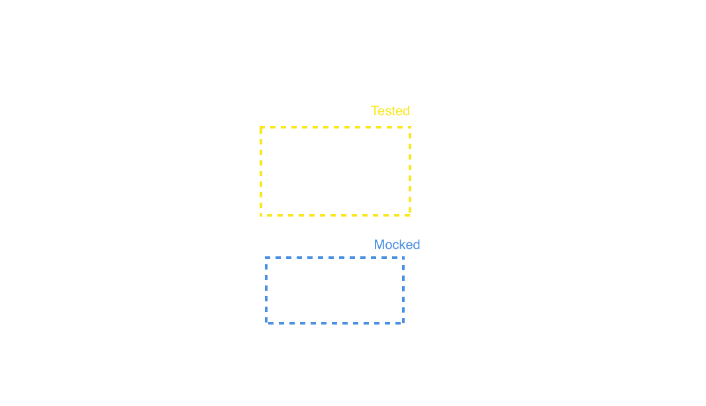
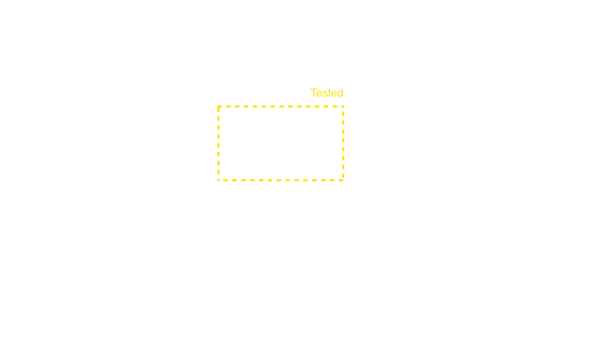

# Network Testing
#### _@pepibumur - iOS Developer at_ SoundCloud

---

### How many of you implement
#_unit tests_
### in your projects?
## 🙋

---

## Specta, _Expecta_, OCMock, __OCMockito__, Quick, _Nimble_, __Kiwi__, _OCHamcrest_

---

## We test _units_ of code
## 📦

---



---


### :package: *can* work as expected
### ↔️ but *not* the integration

---

## _Integration_ tests

---

## We test the units of code
### _As a system_ :package: ↔️ :package:

---



---

### **But...**
## Your components are used by *ViewControllers*

---

### And these ones
## Have a *lifecycle*
## 🔁

---

### Controlled by your
## application *Users*
## 👨‍👨‍👦‍👦

---

## 👨‍👨‍👦‍👦
## Are part of the *system*

---

## :package: ↔️ 👨‍👨‍👦‍👦 ↔️  :package:

---

### _And we should test it..._
# Don't we?
### 😬

---

### How many of you implement
##_acceptance tests_
### in your projects?
## 🙋

---


---

### *They rely on Accessibility*
## Thus, the UI layer

---

```swift
let app = XCUIApplication()
app.launch()
app.buttons["Stream"].tap()
app.tables.staticTexts["Enrique Iglesias"].tap()
```

---

### **We test from the**
## User's viewpoint

---

# But...

---

### *Non-UI stuff*
#### **(That depends on the views lifecycle)**
## Is also taking place

---

# 🌍
### Networking

---

#### 🌍that reflects on UI
## API interaction
#### 🌍that doesn't reflect on UI
## Analytics

---

#### *API interaction*
## Can be tested with Acceptance Tests

---

```swift
let app = XCUIApplication()
app.launch()
app.buttons["Stream"].tap() //-----> REQUEST SENT
let enriqueCell = app.tables.staticTexts["Enrique Iglesias"]
enriqueCell.tap() // -----> REQUEST :+1:
```

---

### But Analytics...

---

```swift
let app = XCUIApplication()
app.launch()
app.buttons["Stream"].tap() //-----> SCREEN EVENT SENT
let enriqueCell = app.tables.staticTexts["Enrique Iglesias"]
enriqueCell.tap() // -----> WAS IT REALLY SENT?
```

---

## What can I do then? 🤔
#### *(Analytics might be critical for your business 💰)*

---

# Szimpla
### _Network Testing in Swift_
#### github.com/pepibumur/szimpla


---


---

## Only 3️⃣ Steps

---

### 1. Record the Snapshot

---

```swift
class AppUITests: XCTestCase {

    func testDefault() {
        try! Szimpla.instance.start()
        let app = XCUIApplication()
        app.buttons["Navigate"].tap()
        try! Szimpla.instance.record(path: "CMDUConf.json")
    }
}
```

---

### 2. Validate the Snapshot

---

```json
[
  {
    "url": "https://api.soundcloud.com/tracks/1235123",
    "parameters": {},
    "body": {}
  }
]
```

---

```json
[
  {
    "url": "https://api.soundcloud.com/tracks/[0-9]+",
    "parameters": {},
    "body": {}
  }
]
```

---

### 3. Update the test

---

```swift
class AppUITests: XCTestCase {

    func testDefault() {
        try! Szimpla.instance.start()
        let app = XCUIApplication()
        app.buttons["Navigate"].tap()
        try! Szimpla.instance.validate(path: "CMDUConf.json")
    }
}
```

---

## Live Demo
### :grinning: 🌴


---

## Spanshot Approach
#### *(Inspired by Facebook Snapshot Testing)*

---

### _Supports_
## Custom Validators

---

```swift
public protocol Validator {
  func validate(recordedRequests recordedRequests: [Request], localRequests: [Request]) throws
}
```

---

### _Supports_
## Custom Filters

---

```swift
public protocol RequestFilter {
    func include(request request: Request) -> Bool
}
```

---

## Analytics Team
### __Can validate the snapshots__
#### It's a JSON file! :tada:
### :memo:

---

## References
- [Szimpla](https://github.com/pepibumur/szimpla)
- [Facebook Snapshot Testing](https://github.com/facebook/ios-snapshot-test-case)
- [Swifter HTTP Server](https://github.com/httpswift/swifter)
- [Unsplash](https://unsplash.com)

---

# Gràcies :grinning:
### Questions?
#### Slides (SpeakerDeck) - [http://bit.ly/29xRq7m](http://bit.ly/29ekocn)
#### pepibumur - pepibumur@gmail.com


