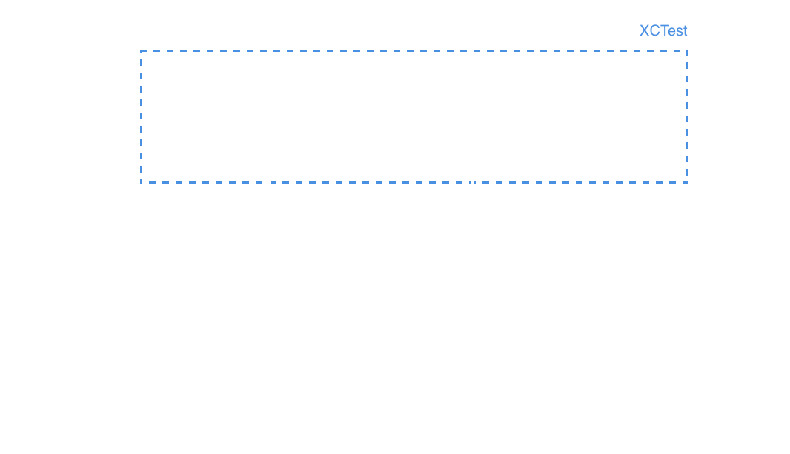

# Network Testing
#### _@pepibumur - iOS Developer at_ SoundCloud

---

### How many of you implement
#_unit tests_
### in your projects?
## 🙋

---

## Specta, _Expecta_, OCMock, __OCMockito__, Quick, _Nimble_, __Kiwi__, _OCHamcrest_

---

## We test _units_ of code
## 📦

---


---

## _Integration_ tests

---

## We test the units of code
### _As a system_ :package: ↔️ :package:

---

### :package: *can* work as expected
### ↔️ but *not* the integration

---


---

### **But...**
## Your components are used by *ViewControllers*

---

### And these ones
## Have a *lifecycle*
## 🔁

---

### Controlled by your
## application *Users*
## 👨‍👨‍👦‍👦

---

## 👨‍👨‍👦‍👦
## Are part of the *system*

---

## :package: ↔️ 👨‍👨‍👦‍👦 ↔️  :package:

---

### _And we should test it..._
# Don't we?
### 😬

---

### How many of you implement
##_acceptance tests_
### in your projects?
## 🙋

---



---

### *They rely on Accessibility*
## Thus, the UI layer

---

```swift
openCmdUConfApp()
tapInfo()
expect(infoView.header.hidden) == false
```

---

### **We test from the**
## User's viewpoint

---

# But...

---

### *Non-UI stuff*
## Is also taking place

---

# 🌍
### Networking

---

#### 🌍that reflects on UI
## API interaction
#### 🌍that doesn't reflect on UI
## Analytics

---

#### *API interaction*
## Can be tested with Acceptance Tests

---

```swift
openApp()
tapInfo() // The sync event is triggered in background
waitUntilContentLoaded()
expect(infoView.header.hidden) == false
```

---

### But Analytics...

---

```swift
openApp()
tapInfo() // The Screen event is sent to the analytics provider
// How do I test if the event was really triggered? 😖
```

---

### _Introducing_
# Szimpla

---

- Snapshot based approach
